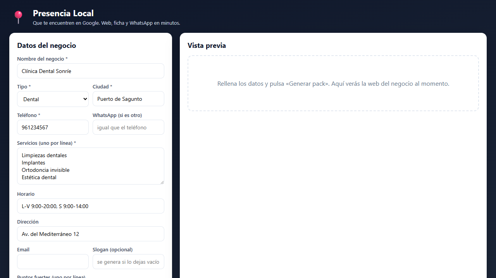
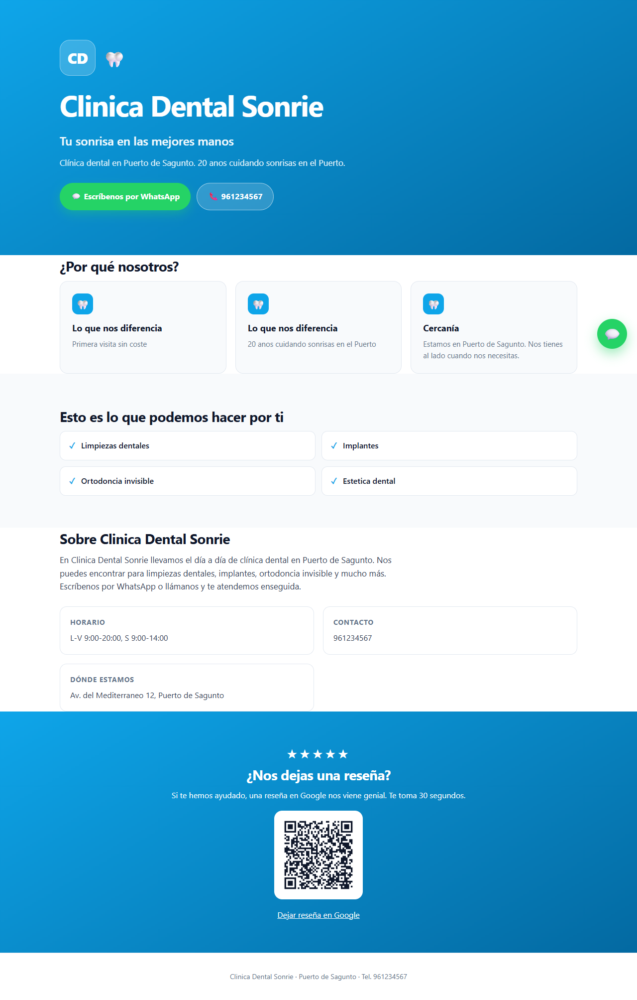

# Faro

**Genera en minutos el pack de presencia digital de un negocio local: una página web premium lista para publicar, el contenido para su ficha de Google, el WhatsApp y la tarjeta de reseñas con QR. Rellenas un formulario, ves la web al momento y descargas todo en un .zip. Funciona sin cuentas de pago.**

[](https://github.com/Ces107/faro/actions/workflows/ci.yml)

---

## Qué es

Muchos negocios locales no tienen web ni aparecen bien en Google. Faro toma los datos de un negocio (nombre, sector, servicios, horario, dirección...) y produce, en minutos, todo lo que necesita para tener una presencia digital de calidad. Una sola herramienta, sin servicios de pago para funcionar.

## Cómo se usa

```bash
pip install -e ".[dev]"
faro                    # abre http://localhost:8000
```

Rellenas el formulario, pulsas "Generar pack" y ves la web del negocio al momento en la vista previa. Descargas el `.zip` con todo dentro.



## Qué genera

- **Una página web premium de una sola página**, responsive y lista para publicar. HTML autocontenido (estilos, animaciones y QR incrustados; sin dependencias externas): se sube a cualquier hosting estático y funciona. Incluye navegación, secciones de servicios, "por qué nosotros", proceso, preguntas frecuentes, reseñas, "cómo llegar" y contacto, con el color de marca del negocio, logo de iniciales, animaciones al hacer scroll y banner de cookies.
- **SEO real**: datos estructurados de schema.org (`LocalBusiness` + horario), Open Graph para compartir y favicon propio.
- **El contenido para Google Business Profile**: descripción optimizada, categorías sugeridas, publicaciones para empezar y respuestas tipo para reseñas.
- **El WhatsApp**: enlace `wa.me` con mensaje pre-rellenado y su QR.
- **La tarjeta de reseñas**: imprimible, con el QR que lleva a dejar la reseña en Google.
- **El aviso legal** de la web (LSSI-CE) con sección de cookies.



## Prospección (faro-prospect)

`faro-prospect <municipio>` construye un censo de negocios de la zona sin
presencia web mapeada (datos © OpenStreetMap contributors, ODbL) y genera una
hoja de ruta imprimible por calles, folletos por sector con QR a los ejemplos
y la precarga del formulario por negocio (`/?prefill=<negocio>`): la demo en
puerta pasa de ~10 minutos a ~1. El censo es local y no se commitea (datos
reales de negocios). Detalles, límites honestos y reglas de uso (LSSI, RGPD,
ODbL) en [docs/prospect.md](docs/prospect.md).

## Demo en vivo y publicación (faro-demo / faro-publish)

`faro-demo casa-paco` arranca el servidor, abre un túnel público efímero (sin
cuenta) y muestra un **QR**: el cliente lo escanea y ve **su** web en **su**
móvil, en la puerta. `faro-publish casa-paco` deja la web online de verdad en una
URL persistente `*.pages.dev` (Cloudflare Pages, free tier) para entregar tras
cerrar. Detalles, requisitos y notas de red en [docs/demo.md](docs/demo.md).

## Modo plantillas y modo IA
| | Plantillas (por defecto) | IA (opcional) |
|---|---|---|
| Copy de la web | Plantillas de calidad por sector | API de Anthropic (Claude) |
| Requiere | Nada | `ANTHROPIC_API_KEY` + `pip install -e ".[live]"` y `FARO_LIVE=1` |

Sin clave de API, el copy sale de plantillas de calidad y la herramienta funciona entera. Con clave, el texto lo redacta el modelo; si la API falla o tarda, se cae a las plantillas (timeout incluido). El flujo crítico no depende del modelo.

## Privacidad y cumplimiento

- El mapa de Google Maps **no carga hasta que el visitante lo pide** (consentimiento de cookies, RGPD/AEPD).
- La web incluye **aviso legal** (LSSI-CE) y banner de cookies.
- El email del negocio va **ofuscado** frente a rastreadores de spam.
- El contenido del negocio se **escapa** (sin inyección de HTML/JS).
- Honesto por diseño: nunca inventa reseñas, premios ni datos que no se le hayan dado.

## Arquitectura

```
src/faro/
  business.py    modelo del negocio (datos + validación + tema por sector)
  content.py     copy de la web (plantillas + LLM opcional con fallback)
  playbook.py    contenido curado por sector (proceso, FAQ, beneficios, titulares)
  sections.py    construye servicios, FAQ y estadísticas a partir de los datos
  icons.py       familia de iconos de línea en SVG (sin CDN)
  landing.py     render de la web premium (Jinja2)
  templates/     plantilla premium de la web
  gmb.py         contenido para Google Business Profile
  seo.py         datos estructurados schema.org + Open Graph + favicon
  hours.py       parseo de horario a schema.org openingHoursSpecification
  maps.py        mapa de Google Maps (consent-gated)
  whatsapp.py    enlaces de WhatsApp y teléfono
  reviews.py     reseñas: enlace, QR, respuestas tipo
  legal.py       aviso legal + cookies
  qr.py          códigos QR en SVG (segno, sin dependencias de pago)
  pack.py        arma el pack completo y lo empaqueta en .zip
  server.py      API FastAPI + servidor de la demo
web/             el formulario y la vista previa
tests/           suite de tests
```

## Calidad

```bash
python -m pytest
python -m ruff check src tests
python -m mypy        # --strict
```

CI en Python 3.10, 3.11 y 3.12.

## Licencia

MIT. Ver [`LICENSE`](LICENSE).
